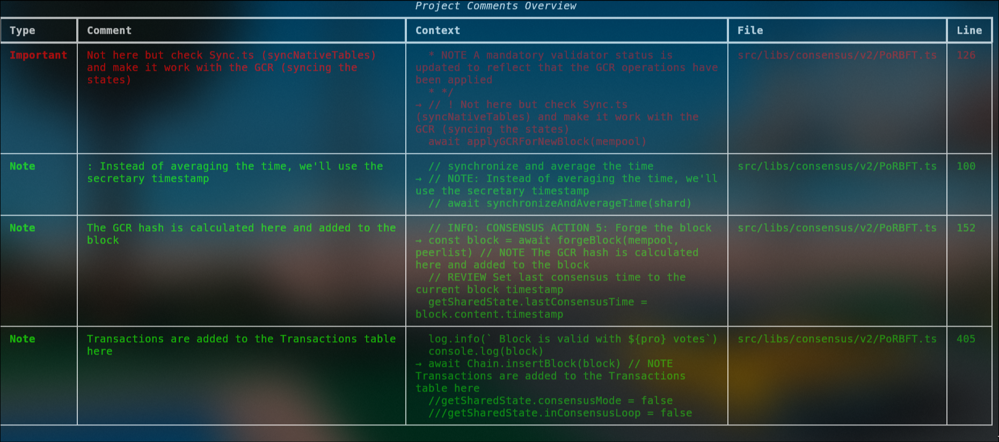

# Overseer

A command-line tool for scanning and managing code comments in your projects. It helps you track TODOs, FIXMEs, and other comment markers across your codebase.



## Features

- 🔍 Scan for comment markers (TODO, FIXME, etc.) in your codebase
- 📁 Filter files by name (partial or exact match)
- 🎯 Customizable comment markers to include/exclude
- 📝 Show code context around comments
- 📤 Export results to different formats (text, JSON, PDF)
- 🚫 Respects .gitignore patterns
- 🔒 Skip hidden files and directories

## Configuration and compatibility

### Supported languages

- TypeScript
- JavaScript
- Python
- C/C++
- Java
- Ruby
- PHP

To add support for a new language, you would simply add its patterns to the `COMMENT_PATTERNS` dictionary in `config.py`.

### Default markers

- TODO
- FIXME
- REVIEW
- NOTE
- !
- ?

You can add your own markers by editing the `config.py` file.

## Installation

### Clone the repository

```bash
git clone https://github.com/tcsenpai/overseer.git
cd overseer
```

### Install dependencies

```bash
pip install -r requirements.txt
```

or, using uv:

NOTE: Using uv, you can run the script directly without installing dependencies as `uv run python main.py` (see below for usage), as the `pyproject.toml` file is present. You can still install dependencies using the command below if you prefer.

```bash
uv pip install -r requirements.txt
```

## Usage

```bash
python main.py --help
```

or, using uv:

```bash
uv run python main.py --help
```

```bash

usage: main.py [-h] [--workspace WORKSPACE] [--skip SKIP [SKIP ...]] [--include-all] [--no-context] [--export {pdf,xlsx}] [--output OUTPUT]
               [--filename FILENAME] [--complete-match] [--case-sensitive]

Scan TypeScript project comments

options:
  -h, --help            show this help message and exit
  --workspace WORKSPACE, -w WORKSPACE
                        Path to the workspace directory
  --skip SKIP [SKIP ...], -s SKIP [SKIP ...]
                        Markers to skip (e.g., --skip NOTE TODO)
  --include-all, -a     Include all markers (override default skip)
  --no-context, -nc     Don't show context lines around comments
  --export {pdf,xlsx}, -e {pdf,xlsx}
                        Export format (pdf or xlsx)
  --output OUTPUT, -o OUTPUT
                        Output file path for export

filename filtering:
  --filename FILENAME, -f FILENAME
                        Filter files by filename (case insensitive by default)
  --complete-match, -c  Match complete filename instead of partial (only with -f)
  --case-sensitive, -C  Make filename filter case sensitive (only with -f)
```

## Examples

```bash
  main.py                                    # Scan all files with default settings
  main.py -w /path/to/project               # Scan a specific workspace
  main.py -f test.py                        # Find comments in files containing 'test.py' (case insensitive)
  main.py -f test.py -c                     # Find comments in files named exactly 'test.py'
  main.py -f Test.py -C                     # Find comments with case-sensitive filename match
  main.py -f test.py -c -C                  # Find comments in files named exactly 'test.py' (case sensitive)
  main.py --skip TODO FIXME                 # Skip TODO and FIXME comments
  main.py -a                                # Include all comment types
  main.py -e pdf -o comments.pdf            # Export comments to PDF
```

## Command Line Options

| Option             | Short | Description                                        |
| ------------------ | ----- | -------------------------------------------------- |
| `--workspace`      | `-w`  | Specify workspace directory to scan                |
| `--filename`       | `-f`  | Filter files by name (case insensitive by default) |
| `--complete-match` | `-c`  | Match complete filename instead of partial         |
| `--case-sensitive` | `-C`  | Make filename filter case sensitive                |
| `--skip`           |       | Skip specified comment markers                     |
| `--include-all`    | `-a`  | Include all comment types                          |
| `--no-context`     |       | Hide code context around comments                  |
| `--export`         | `-e`  | Export format (text, json, pdf)                    |
| `--output`         | `-o`  | Output file path                                   |

## Configuration

The tool respects:

- `.gitignore` patterns in your project
- Hidden files and directories (starting with .)
- Project-specific file patterns (configured in `config.py`)
